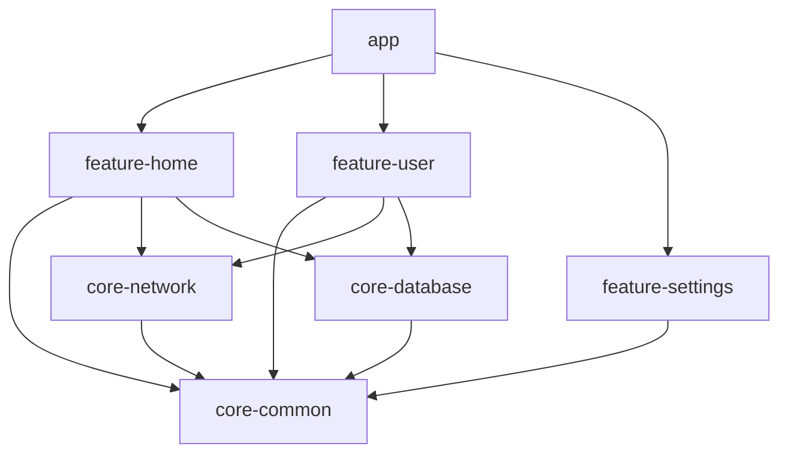
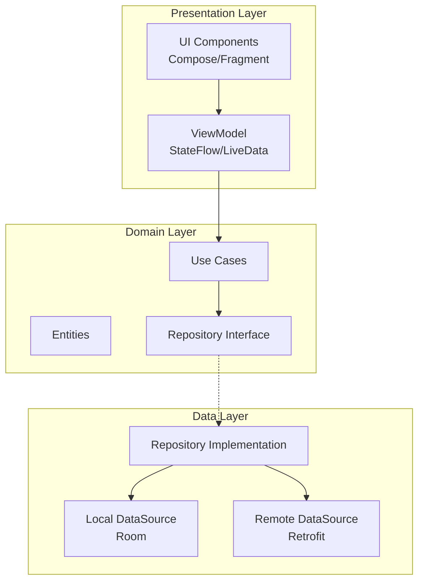

# 安卓应用架构方案

## 1. 架构模式选择

### 推荐方案：MVVM + Clean Architecture

#### 选择理由
- **MVVM（Model-View-ViewModel）**：Google 官方推荐，与 Jetpack 组件（LiveData、StateFlow）深度集成
- **Clean Architecture**：分层清晰，业务逻辑独立于框架，便于测试和维护
- **组合优势**：MVVM 处理 UI 层，Clean Architecture 确保核心业务可移植性

#### 架构分层
```
┌─────────────────────────────────────┐
│         Presentation Layer          │
│    (Activity/Fragment/Composable)   │
├─────────────────────────────────────┤
│           Domain Layer              │
│      (Use Cases / Entities)         │
├─────────────────────────────────────┤
│            Data Layer               │
│  (Repository / DataSource / API)    │
└─────────────────────────────────────┘
```

---

## 2. 技术栈选型

### 2.1 开发语言
| 选项 | 选择 | 理由 |
|------|------|------|
| Kotlin | ✅ | Google 首选，空安全、协程支持、代码简洁 |
| Java | ❌ | 遗留项目考虑，新项目不推荐 |

### 2.2 依赖注入
| 库 | 选择 | 理由 |
|----|------|------|
| Hilt | ✅ | 基于 Dagger，Android 专用，编译时注入，减少样板代码 |
| Koin | ⚠️ | 轻量级，运行时注入，适合小项目 |
| Dagger | ❌ | 配置复杂，Hilt 更优 |

### 2.3 网络库
| 库 | 选择 | 理由 |
|----|------|------|
| Retrofit + OkHttp | ✅ | 行业标准，类型安全，拦截器强大 |
| Volley | ❌ | 已过时 |
| Ktor Client | ⚠️ | Kotlin 原生，但生态不如 Retrofit |

### 2.4 本地数据库
| 库 | 选择 | 理由 |
|----|------|------|
| Room | ✅ | Android Jetpack 组件，编译时 SQL 验证 |
| Realm | ⚠️ | 性能好，但包体积大 |
| SQLite | ❌ | 直接使用过于底层 |

### 2.5 异步处理
| 方案 | 选择 | 理由 |
|------|------|------|
| Kotlin Coroutines + Flow | ✅ | 官方推荐，轻量，与 Lifecycle 集成 |
| RxJava | ❌ | 学习曲线陡峭，已被协程取代 |

### 2.6 UI 框架
| 选项 | 选择 | 理由 |
|------|------|------|
| Jetpack Compose | ✅ | 声明式 UI，未来趋势，代码量少 |
| XML + ViewBinding | ⚠️ | 传统方案，维护现有项目时使用 |

---

## 3. 模块划分与依赖关系

### 3.1 模块化设计
```
app/                    # 主应用模块（壳）
├── core-common/        # 通用工具类、扩展函数
├── core-network/       # 网络层封装
├── core-database/      # 数据库层封装
├── feature-home/       # 首页功能模块
├── feature-user/       # 用户相关模块
├── feature-settings/   # 设置模块
└── build-logic/        # 构建脚本集中管理
```

### 3.2 模块依赖关系图


### 3.3 模块职责
| 模块 | 职责 | 依赖 |
|------|------|------|
| `app` | Application 入口、导航、DI 容器 | 所有 feature 模块 |
| `core-common` | 工具类、常量、扩展函数 | 无 |
| `core-network` | Retrofit 配置、API 接口定义 | core-common |
| `core-database` | Room 配置、DAO、Entity | core-common |
| `feature-*` | 具体业务功能 | core-* 模块 |

---

## 4. 核心架构图

### 4.1 整体架构


### 4.2 数据流设计
```
用户操作 → UI Event → ViewModel → UseCase → Repository
                                              ↓
                              ┌───────────────┴───────────────┐
                              ↓                               ↓
                        Local Source                     Remote Source
                        (Room DB)                       (REST API)
                              ↓                               ↓
                              └───────────────┬───────────────┘
                                              ↓
                                        Entity/Data Model
                                              ↓
                                        StateFlow
                                              ↓
                                          UI Render
```

---

## 5. 目录结构建议

### 5.1 标准目录结构
```
app/
├── src/main/
│   ├── java/com/example/app/
│   │   ├── AppApplication.kt          # Application 入口
│   │   ├── di/                        # Hilt DI 模块
│   │   │   ├── AppModule.kt
│   │   │   ├── NetworkModule.kt
│   │   │   └── DatabaseModule.kt
│   │   │
│   │   ├── core/                      # 核心层
│   │   │   ├── common/                # 通用工具
│   │   │   │   ├── extensions/
│   │   │   │   ├── constants/
│   │   │   │   └── utils/
│   │   │   ├── network/               # 网络层
│   │   │   │   ├── ApiService.kt
│   │   │   │   ├── interceptors/
│   │   │   │   └── models/
│   │   │   └── database/              # 数据库层
│   │   │       ├── AppDatabase.kt
│   │   │       ├── dao/
│   │   │       ├── entity/
│   │   │       └── converters/
│   │   │
│   │   ├── domain/                    # 领域层
│   │   │   ├── model/                 # Entities
│   │   │   ├── repository/            # Repository 接口
│   │   │   └── usecase/               # Use Cases
│   │   │       ├── home/
│   │   │       ├── user/
│   │   │       └── settings/
│   │   │
│   │   └── presentation/              # 表现层
│   │       ├── navigation/            # 导航图
│   │       ├── theme/                 # Compose Theme
│   │       ├── components/            # 通用 UI 组件
│   │       │
│   │       └── feature/               # 功能模块
│   │           ├── home/
│   │           │   ├── HomeScreen.kt
│   │           │   ├── HomeViewModel.kt
│   │           │   ├── model/
│   │           │   └── navigation/
│   │           │
│   │           ├── user/
│   │           │   ├── UserScreen.kt
│   │           │   ├── UserViewModel.kt
│   │           │   └── ...
│   │           │
│   │           └── settings/
│   │               ├── SettingsScreen.kt
│   │               └── SettingsViewModel.kt
│   │
│   └── res/                           # 资源文件
│       ├── values/
│       ├── drawable/
│       └── ...
│
├── build.gradle.kts                   # 模块级构建配置
├── proguard-rules.pro                 # 混淆规则
└── ...

build-logic/                           # 构建逻辑集中管理
├── convention/
│   ├── android-application.gradle.kts
│   ├── android-library.gradle.kts
│   └── android-feature.gradle.kts
└── settings.gradle.kts
```

### 5.2 关键文件示例

#### ViewModel 模板
```kotlin
@HiltViewModel
class HomeViewModel @Inject constructor(
    private val getHomeDataUseCase: GetHomeDataUseCase
) : ViewModel() {
    
    private val _uiState = MutableStateFlow<UiState<HomeData>>(UiState.Loading)
    val uiState: StateFlow<UiState<HomeData>> = _uiState.asStateFlow()
    
    init {
        loadHomeData()
    }
    
    fun loadHomeData() {
        viewModelScope.launch {
            _uiState.value = UiState.Loading
            getHomeDataUseCase()
                .catch { e -> _uiState.value = UiState.Error(e.message) }
                .collect { data -> _uiState.value = UiState.Success(data) }
        }
    }
}
```

#### Repository 实现
```kotlin
class HomeRepositoryImpl @Inject constructor(
    private val localDataSource: HomeLocalDataSource,
    private val remoteDataSource: HomeRemoteDataSource
) : HomeRepository {
    
    override suspend fun getHomeData(): Flow<HomeData> = flow {
        // 优先从本地加载
        val localData = localDataSource.getHomeData()
        if (localData != null) {
            emit(localData)
        }
        
        // 从网络刷新
        val remoteData = remoteDataSource.fetchHomeData()
        localDataSource.saveHomeData(remoteData)
        emit(remoteData)
    }.flowOn(Dispatchers.IO)
}
```

---

## 6. 开发规范与最佳实践

### 6.1 代码规范
- **命名规范**：
  - 类名：PascalCase（`HomeViewModel`）
  - 函数/变量：camelCase（`loadHomeData`）
  - 常量：SCREAMING_SNAKE_CASE（`MAX_RETRY_COUNT`）
  - 私有属性：下划线前缀（`_uiState`）

- **文件组织**：
  - 每个类单独文件
  - 按功能模块分组
  - 导入顺序：Android → Kotlin → 第三方 → 内部

### 6.2 最佳实践

#### 1. 协程使用
```kotlin
// ✅ 正确：在 ViewModel 中使用 viewModelScope
viewModelScope.launch {
    // 自动取消
}

// ✅ 正确：IO 操作使用 Dispatchers.IO
withContext(Dispatchers.IO) {
    // 数据库/网络操作
}

// ❌ 错误：避免 GlobalScope
GlobalScope.launch { }  // 可能导致内存泄漏
```

#### 2. StateFlow vs LiveData
```kotlin
// ✅ 推荐：StateFlow（Kotlin 原生）
val uiState: StateFlow<UiState> = _uiState.asStateFlow()

// ⚠️ 仅在需要与 Java 互操作时使用 LiveData
val uiState: LiveData<UiState> = _uiState.asLiveData()
```

#### 3. 依赖注入
```kotlin
// ✅ 使用 Hilt 注解
@HiltViewModel
class MyViewModel @Inject constructor(
    private val repository: MyRepository
) : ViewModel()

// ✅ Module 中提供依赖
@Module
@InstallIn(SingletonComponent::class)
object AppModule {
    @Provides
    fun provideRepository(): MyRepository = MyRepositoryImpl()
}
```

#### 4. 错误处理
```kotlin
// ✅ 使用 Result 或密封类
sealed class UiState<out T> {
    object Loading : UiState<Nothing>()
    data class Success<T>(val data: T) : UiState<T>()
    data class Error(val message: String?) : UiState<Nothing>()
}

// ✅ 统一异常处理
try {
    // 业务逻辑
} catch (e: ApiException) {
    // API 错误
} catch (e: DbException) {
    // 数据库错误
} catch (e: Exception) {
    // 未知错误
}
```

### 6.3 测试策略
| 层级 | 测试类型 | 工具 |
|------|----------|------|
| Unit Test | 单元测试 | JUnit + Mockk |
| Integration Test | 集成测试 | HiltTest + Truth |
| UI Test | UI 自动化测试 | Espresso + Compose Testing |

### 6.4 CI/CD 建议
```yaml
# GitHub Actions 示例
name: Android CI
on: [push, pull_request]
jobs:
  build:
    runs-on: ubuntu-latest
    steps:
      - uses: actions/checkout@v3
      - name: Set up JDK
        uses: actions/setup-java@v3
        with:
          java-version: '17'
      - name: Build
        run: ./gradlew build
      - name: Run Tests
        run: ./gradlew test
      - name: Upload APK
        uses: actions/upload-artifact@v3
```

---

## 7. 总结

### 技术栈总览
| 类别 | 技术选型 |
|------|----------|
| 语言 | Kotlin |
| 架构 | MVVM + Clean Architecture |
| DI | Hilt |
| 网络 | Retrofit + OkHttp |
| 数据库 | Room |
| 异步 | Coroutines + Flow |
| UI | Jetpack Compose |
| 导航 | Navigation Component |

### 关键优势
1. **可测试性**：分层清晰，依赖注入便于 Mock
2. **可维护性**：模块化设计，职责分离
3. **可扩展性**：新功能独立模块，不影响现有代码
4. **现代化**：采用最新官方推荐技术栈

---

*文档版本：1.0*  
*创建时间：2026-04-07*  
*适用项目：Android 应用开发*
